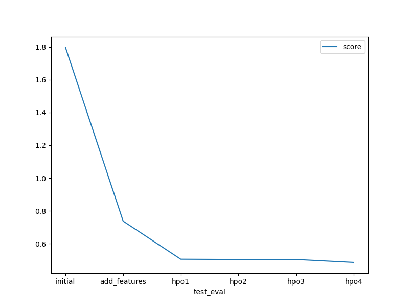

# Report: Predict Bike Sharing Demand with AutoGluon Solution
#### Mugabi Elvis

## Initial Training
### What did you realize when you tried to submit your predictions? What changes were needed to the output of the predictor to submit your results?
The first prediction score, without EDA, was the lowest. To format the results correctly, it was necessary to replace any negative predictions with `0` and format the submission file with both the `count` and `datetime` columns. 

### What was the top ranked model that performed?
`WeightedEnsemble_L3`

## Exploratory data analysis and feature creation
### What did the exploratory analysis find and how did you add additional features?
The EDA stage helped to achieve two main outcomes;  
1. Study the data in each column and update the dataframe attribute as needed. For instance `weather` and `season` are categories.
2. Detect possibile correlations of each field towards the 'count' column.  The `atemp` and `temp` fields highly correlated (0.984948) so `temp` was dropped. Likewise, `holiday` and `workingday` had a negative and very low correlation to `count` respestively so both were dropped.
3. The `datetime` column was decomposed into to `hour`, `date` and `month` fields which enriched the analysis.

### How much better did your model preform after adding additional features and why do you think that is?
With the added features, the top model `WeightedEnsemble_L3` scored   `-31.841558` which was much better than the inital `-52.729375`

## Hyper parameter tuning
### How much better did your model preform after trying different hyper parameters?
The first run with hyperparameters of returned a lower Algorithm score of `-41.725934` from `-31.841558`. 

### If you were given more time with this dataset, where do you think you would spend more time?
Identifying the noise in the dataset with univariate statistical tests, trying other regression algorithms and optimising the hyperparamters.

### Create a table with the models you ran, the hyperparameters modified, and the kaggle score.
|model|num_trials|scheduler|searcher|score|
|--|--|--|--|--|
|initial|-|-|-|1.79553|
|add_features|-|-|-|0.73774|
|hpo1|60|auto|local|0.5055|
|hpo2|20|random|local|0.50382|
|hpo3|20|random|local|0.50393|
|hpo4|20|random|local|0.48588|

### Create a line plot showing the top model score for the three (or more) training runs during the project.

### Create a line plot showing the top kaggle score for the three (or more) prediction submissions during the project.

## Summary
Proper EDA is such a critical stage in the ML life cycle and will determine the quality and performance of any Model used. Being able to understand the relationship of each feature towards the target value is a necessary skill that separates good ML engineers from the rest. Additionally, theoretcical knowledge in statistics and a firm grasp of the API parameters per model are key in interpreting the results of a model's prediction as well tunning hyperparameters. 